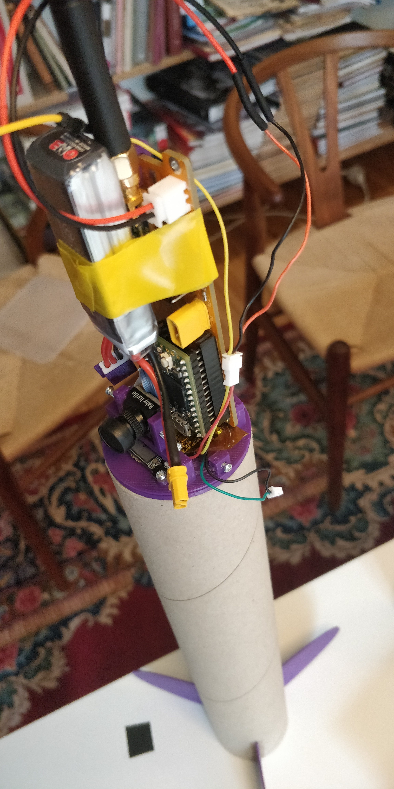
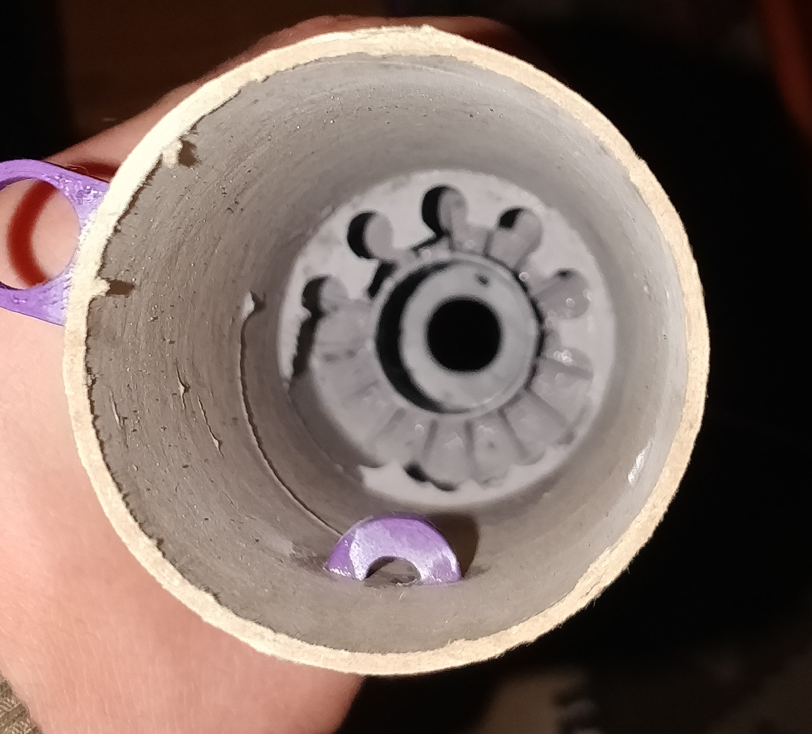
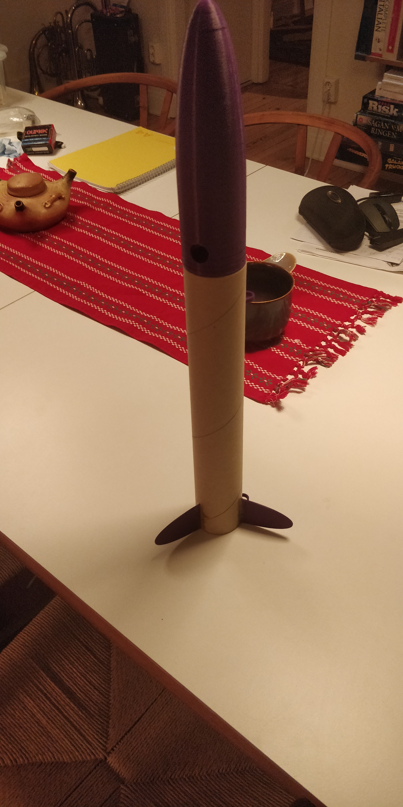
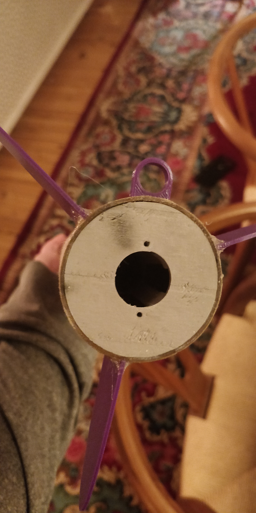
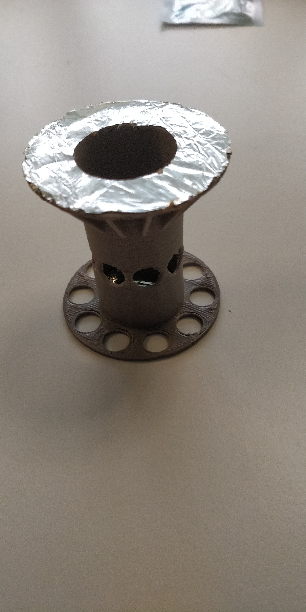

# Rocket1
best flight so far:

https://www.youtube.com/watch?v=-uDBPg2TM70

Maiden flight:

https://www.youtube.com/watch?v=-uDBPg2TM70

## structure
The body tube is a 50mm mailing and everything else is 3d printed. Everything is assembled with m2 screws and glue. PETG is used for the baffle and engine mount while PLA is used for everything else. I also glued a layer of tinfoil to the baffle but that's probably not necessary. The total weight with electronics is about 350g.

## recovery
To ensure a safe recovery the parachute is a 90cm rip-stop from klima. Instead of conventional recovery wadding i designed and 3d-printed a baffle that lets pressure but not particles through. So far it has worked very well but it took a few tries before i realised the walls need to be 3mm thick. 
The parachute is pretty big so it can drift 200m and land in a tree :(

a failed baffle

grainy pic after me shooting it down from a tree with bow and arrow

the whole rocket

engine mount

baffle
